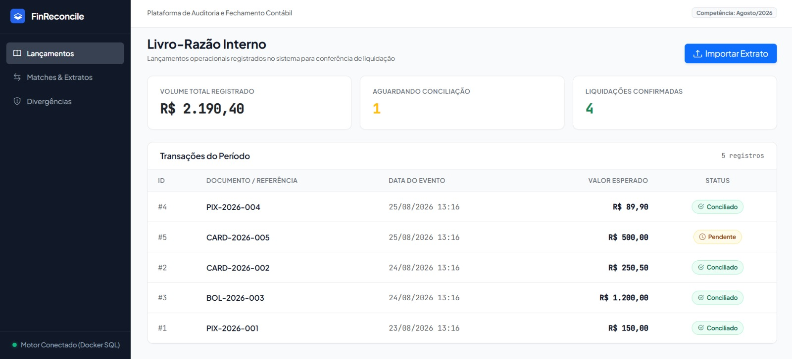
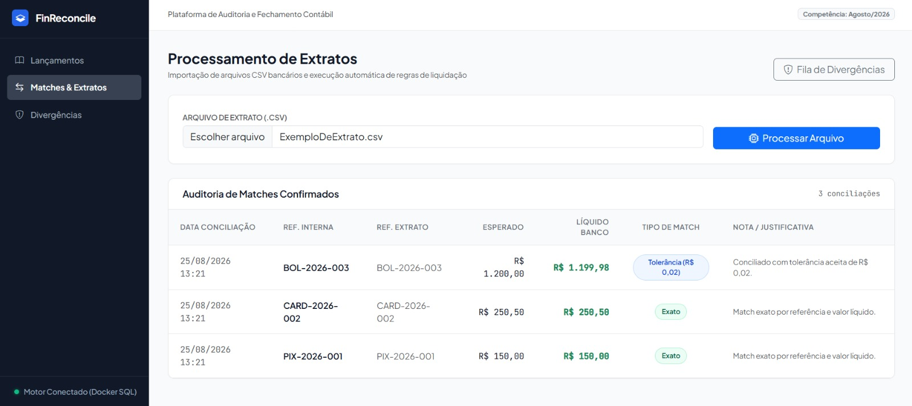
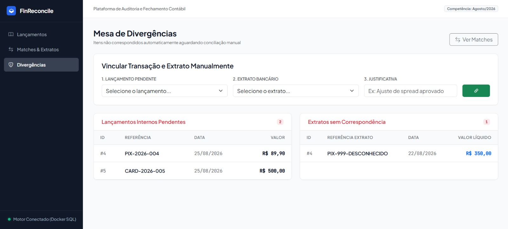
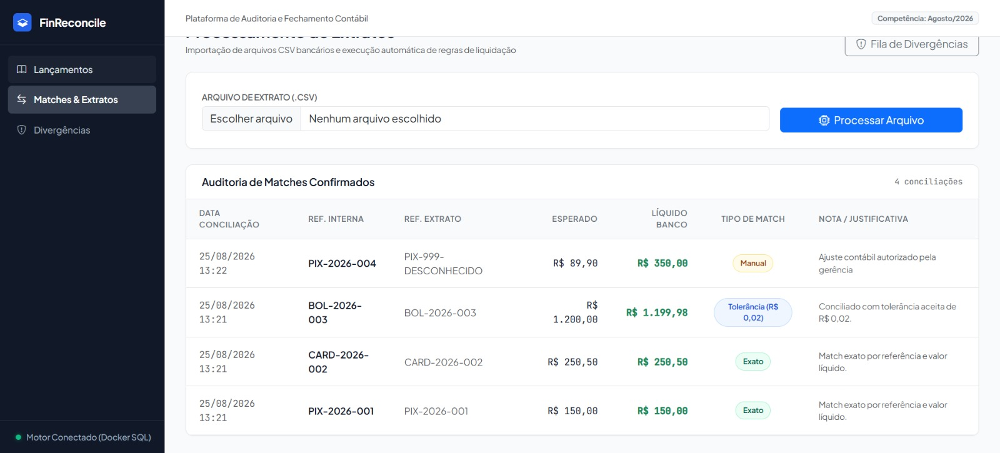
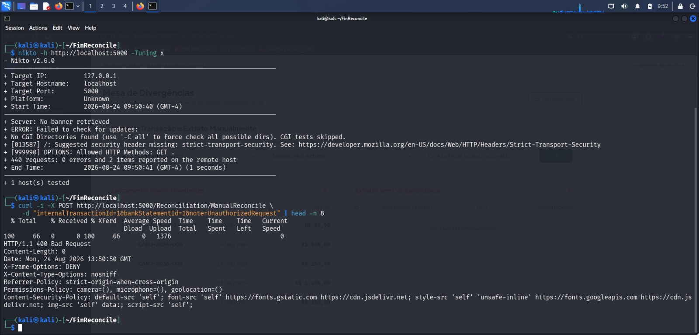
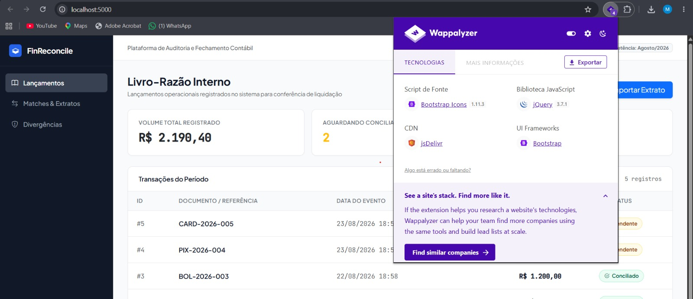

# 🏦 FinReconcile - Auditoria e Fechamento Contábil

<div align="center">
  
  
  
  
  
</div>

<br>

O **FinReconcile** é uma plataforma robusta de conciliação bancária desenvolvida para resolver gargalos de fechamento contábil. O sistema automatiza a conferência entre o Livro-Razão interno e os extratos bancários, aplicando regras de liquidação, tratamento de exceções e trilha de auditoria completa, seguindo rigorosos padrões de arquitetura de software e segurança (OWASP).

---

## 🛠️ Stack Tecnológico

*   **Backend:** C#, .NET 10, Entity Framework Core
*   **Infraestrutura & Banco de Dados:** SQL Server, Docker, Docker Compose
*   **Frontend:** ASP.NET Core MVC, HTML5, CSS3, Bootstrap 5
*   **Testes:** xUnit, FluentAssertions (EF Core InMemory)
*   **Segurança:** OWASP Guidelines, Anti-CSRF, CSP, Server Obfuscation

---

## ⚙️ Arquitetura e Engenharia

O projeto foi estruturado com foco em manutenibilidade e performance:

*   **Separação de Responsabilidades:** Controllers, Services e Data Access isolados, com injeção de dependência via interface (`IReconciliationService`), seguindo os princípios de baixo acoplamento do SOLID.
*   **Otimização de Dados:** Uso de `AsNoTracking()` no EF Core nas consultas somente-leitura (listagens de lançamentos, matches e divergências), eliminando overhead de memória do change tracker.
*   **Integridade Contábil:** Cada operação de conciliação (automática ou manual) é persistida em uma única chamada a `SaveChangesAsync`, garantindo atomicidade e evitando estados inconsistentes entre lançamento interno e extrato bancário.
*   **Resiliência de Infraestrutura:** Estratégia de retry tanto na conexão do EF Core (`EnableRetryOnFailure`) quanto na aplicação das migrations na subida do container, aguardando a inicialização completa do SQL Server no Docker.
*   **Testes Automatizados:** Suíte de testes unitários (xUnit + FluentAssertions) cobrindo as regras de match exato e por tolerância do motor de conciliação.

---

## 📸 Fluxo de Negócio e Funcionalidades

O sistema foi desenhado com uma interface limpa, focada na produtividade do analista financeiro.

### 1. Visão Geral e Livro-Razão

Painel de consolidação com os lançamentos operacionais aguardando conferência e métricas em tempo real.

<br>
<div align="center">
  
</div>
<br>

### 2. Motor de Conciliação Automática

Ingestão de arquivos delimitados (`.csv`) aplicando algoritmos de correspondência:
*   **Match Exato:** Validação por documento e valor líquido.
*   **Tolerância de Spread:** Aceitação configurada de divergências de até R$ 0,05 entre o valor líquido registrado e o valor do extrato.

<br>
<div align="center">
  
</div>
<br>

### 3. Mesa de Divergências

Fila de trabalho para itens órfãos, exigindo intervenção manual com preenchimento obrigatório de justificativa contábil.

<br>
<div align="center">
  
</div>
<br>

### 4. Trilha de Auditoria

Histórico imutável de todas as conciliações e aprovações manuais para conformidade corporativa.

<br>
<div align="center">
  
</div>
<br>

---

## 🛡️ Auditoria de Segurança e Hardening

A aplicação possui múltiplas camadas de defesa no pipeline HTTP (Kestrel), validadas através de testes ofensivos com **Kali Linux**:

*   **Prevenção CSRF:** Validação estrita por tokens criptográficos (`[ValidateAntiForgeryToken]`) em endpoints de mutação.
*   **HTTP Security Headers:** Mitigação de ataques de injeção e clickjacking via `Content-Security-Policy (CSP)`, `X-Frame-Options: DENY`, `X-Content-Type-Options: nosniff`, `Referrer-Policy: strict-origin-when-cross-origin` e `Permissions-Policy`.
*   **Server Obfuscation:** Remoção ativa de assinaturas tecnológicas (Kestrel/ASP.NET) para mitigar *fingerprinting* automatizado.

<br>

**Evidências de Auditoria:**

*Rejeição de payload malicioso (HTTP 400), injeção de cabeçalhos estritos e scan limpo via Nikto.*

<br>
<div align="center">
  
</div>
<br>

*Ocultação da stack backend perante ferramentas de OSINT (Wappalyzer).*

<br>
<div align="center">
  
</div>
<br>

---

## 🚀 Como Executar Localmente

Toda a infraestrutura está conteinerizada, eliminando a necessidade de instalar o SQL Server na máquina hospedeira.

**Pré-requisitos:**
*   [Docker Desktop](https://www.docker.com/products/docker-desktop) instalado e rodando.
*   Git para clonar o repositório.

**1. Clone o repositório:**
```bash
git clone https://github.com/Maiquel-Devs/FinReconcile.git
cd FinReconcile
```

**2. Suba o ambiente via Docker Compose:**
Para construir as imagens e rodar os containers em segundo plano, execute:
```bash
docker compose up --build -d
```

*(Caso queira parar a aplicação posteriormente, execute: `docker compose down`)*

**3. Acesse a aplicação:**
Abra o navegador em `http://localhost:5000`

> **Nota:** O banco de dados (`finreconcile_sql`) é provisionado automaticamente na primeira execução. O *Seed* do Entity Framework populará as tabelas com uma carga inicial de lançamentos para testes imediatos.

---

## 👨‍💻 Autor

**Maiquel Mafra**

Estudante de Engenharia de Software e desenvolvedor interessado em backend, arquitetura de software, observabilidade, automação e inteligência artificial aplicada ao desenvolvimento de sistemas.

**GitHub:** [Maiquel-Devs](https://github.com/Maiquel-Devs)

## 📄 Licença

Este projeto está disponível sob a licença MIT, definida no arquivo [LICENSE](LICENSE).